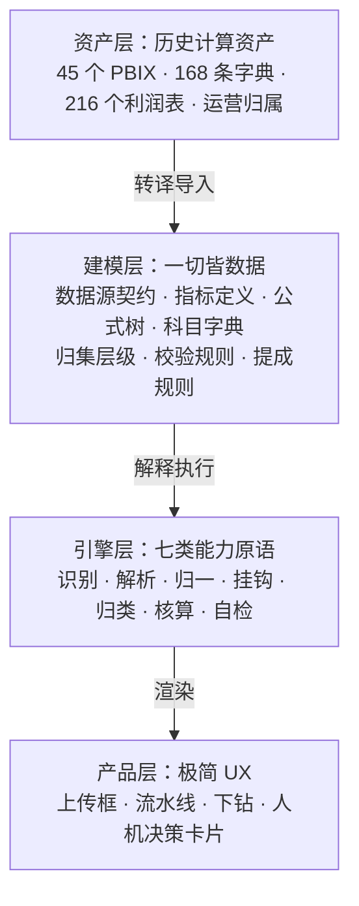

# 电商记账管理系统 PRD

版本 v0.3 | 2026-08-07 | 定位：引擎驱动的标准化产品

---

## 1. 产品定位与总体架构

**做一个引擎，用建模数据驱动它，让它长成一个开箱即用的电商记账产品。**

这句话里有三个部分，缺一不可：

- **引擎**只提供能力，不知道"什么是店铺利润"。它可以服务任何一家公司。
- **建模**是数据不是代码。这家公司的 11 项口径是一份模型数据，下一家是另一份。
- **产品**是建模数据的渲染结果。用户看到的每一个数字、每一张卡片，都由模型定义。

### 1.1 四层架构



### 1.2 三条设计原则

**原则一：引擎里不许出现公司知识。**

引擎知道"如何按一个键做关联"，不知道"订单成本要按线上子订单编号关联"。后者是模型数据。判断标准很简单：换一家公司，引擎代码一行都不用改。

**原则二：不做管理后台。**

产品只有三样东西：一个上传框、一条能一眼看懂的流水线、一个设置向导。建模能力完整存在，但**标品出厂自带一套"中国电商标准模型"，用户开箱不用碰**。要改的时候入口是 AI 对话加试算，不是配置表单，更不是 YAML 编辑器。

**原则三：需要人为判断的地方，做成体验，而不是藏起来。**

非技术用户最怕的不是功能少，是不知道这个数对不对。现有 Excel 加 BI 的模式下所有错误都是静默的。产品的做法是把每一处人为判断变成一张有名有姓、点一下就能推进的卡片——**准确率不是靠校验规则堆出来的，是靠没人能假装数据齐了。**

---

## 2. 引擎层：七类能力原语

引擎是护城河。它固化的是电商行业的既成事实，可复用到任何一家电商公司。以下每一条都有实测数据支撑（依据见附录）。

引擎不含任何科目名、店铺名、公式。它只提供七类原语。

### 2.1 识别（Recognize）

**能力**：给一个文件，判断它是什么。

- 表头签名匹配：用列名集合的哈希比对已登记模板版本
- 从文件名和内容推断平台、主体、期间
- 未登记签名**必须报警，绝不静默丢列**

**为什么这是原语**：静默丢列是这个行业最大的隐形杀手。现有系统里一个模板别名少写一个字（`线上子订单号` 应为 `线上子订单编号`），导致全部商品成本挂不到订单，潜伏很久无人发现——因为它不报错，只是退回去命中了另一个能匹配上的列。

已知规模：千牛明细 19 种签名、微信收款 6 种、拼多多广告 6 种、淘宝万相台 5 种、聚水潭 5 种、抖店广告 3 种。

### 2.2 解析（Parse）

**能力**：把文件变成带行号的原始行。行号是后续全部证据链的锚点。

固化的格式陷阱处理（全部实测确认，与具体公司无关）：

- xlsx 声明的 `<dimension>` 常被写成 `A1`，不重置维度会导致约 160 个文件被读成"只有 1 行"
- CSV 分隔符只看表头行判断——数据单元格里塞了制表符做防格式化，全文件统计会误判成 TSV
- 制表符方向不一致：拼多多和千牛后置、抖店前导，必须双向去除
- 编码按模板版本固定，不靠猜
- 混合类型字段容错（如淘宝退款金额在无退款时是文本"无退款申请"）
- 空值表示不统一（拼多多广告和抖店 ROI 用 `-`）
- **重复列名按位置解析**：千牛明细有 3 种签名存在重复列名，涉及 87 个文件，按列名建字典会静默丢数据

### 2.3 归一（Normalize）

**能力**：把各平台的表达差异抹平，产出统一的内部表示。

四类归一：

- **金额** → `有符号金额 + 方向枚举`。符号规则绑定模板版本，不绑列名——实测存在同一列里正负混存，符号无法从数据本身推断
- **粒度** → 声明式去重。引擎提供"某些字段是父级字段，聚合前需按某个键去重"这一原语，具体哪些字段、按什么键，是模型数据
- **标识** → 支持多层 ID 并存与显式转换（平台商品 ID、平台 SKU ID、内部编码）
- **时间** → 归入五类语义槽位：下单、支付、发货、确认收货、结算

### 2.4 挂钩（Link）

**能力**：按声明的键做关联，并把结果归集到声明的层级。

- 支持任意层级：订单级、商品级、期间级，层级由模型声明，引擎不猜
- 关联键支持从文本正则提取（支付宝账务明细没有订单号列，订单号埋在备注里，格式还有花括号、圆括号、直接拼接三种），提取规则带版本，失败率超阈值告警
- 每次关联产出命中率，进入自检层

### 2.5 归类（Classify）

**能力**：按字典把原始科目映射到统一科目。

- 字典是模型数据，引擎只负责查表与未命中告警
- 未命中时调用 AI 提出建议，人工确认后写回字典，之后走确定性归类

### 2.6 核算（Calculate）

**能力**：按公式树求值。

- 公式树是模型数据，引擎是求值器
- 支持的算子集合刻意保持最小：过滤、求和、乘积求和、比值、加总、取负。这个集合足以覆盖全部 2288 个现有 DAX 度量值
- 时间归属规则由模型声明（按下单日 / 按发生日），引擎执行

### 2.7 自检（Audit）

**能力**：在结账前拦截。

- 关联命中率是否达标
- 是否存在未归类科目
- 数据完整度是否达标（哪些数据源还没到）
- 勾稽关系是否成立
- 未归属金额是否已显式呈现

**这道关卡是产品最重要的设计**。它把"我不知道这数对不对"变成"系统不让我在数不对的时候结账"。

---

## 3. 建模层：一切皆数据

建模层是引擎与产品之间的唯一契约。它有六类对象。

### 3.1 数据源契约

声明"这个系统需要哪些数据、每份数据归谁维护"。这是完整度机制的基础，也是把人为判断变成体验的支点。

每个数据源声明：

- 标识与所属平台
- **责任角色**（店铺负责人 / 仓储 / 物流 / 运营 / 财务）
- 提供频率（每日 / 每月 / 一次性）
- 它能供给哪些字段
- 缺失时会影响哪些指标

这家公司的实际分工（供参考，属模型数据）：

- **店铺负责人上传**：宝贝报表（订单）、平台资金流水、平台费用明细、广告费报表
- **仓储维护**：聚水潭成本
- **物流维护**：运费
- **运营维护**：补单费用、代购代发、运营链接（商品与负责人归属）
- **财务维护**：线下费用、日记账

### 3.2 指标定义

每个指标是一个五元组，可任意搭配组合：

```
指标 = (数据源, 取值表达式, 关联键与层级, 符号方向, 责任来源)
```

举例：

```
订单成本
  来源   聚水潭成本
  取值   SUM(数量 × 成本价)
  去重   订单级字段先按 线上子订单编号 去重（本指标为行级字段，不需要）
  关联   线上子订单编号 → 订单.子订单编号
  层级   订单级
  符号   取负
  责任   仓储部

广告费
  来源   平台广告报表
  取值   SUM(花费)
  关联   商品ID + 日期 → 商品
  层级   商品级
  符号   取负
  归属   按花费日（非下单日）
  责任   店铺负责人

交易收款
  来源   平台资金流水
  过滤   业务大类 = 交易收款
  取值   SUM(收入金额 + 支出金额)
  关联   业务基础订单号 → 订单.子订单编号
  层级   订单级
  符号   原样
  责任   店铺负责人
```

**这就是"任意搭配解析组合"**。加一个新指标不需要改代码，只需要新增一条定义。

### 3.3 公式树

利润表的结构完全由模型定义，层数不限。

这家公司的默认模型（出厂自带，用户不用配）：

- **第一层，5 组**：销售净收入、商品成本、平台费用、物流费用、推广费用 → 利润
- **第二层，11 项**：即现有工资表口径，老员工熟悉
  - 销售净收入 = 交易收款 + 交易退款 + 交易赔付
  - 商品成本 = 订单成本 + 补发成本 + 代购代发
  - 平台费用 = 软件服务费 + 营销费用
  - 物流费用 = 发货运费
  - 推广费用 = 广告费 + 本金佣金
- **第三层**：科目字典里的平台原始科目
- **第四层**：原始文件、工作表、行号

补单的本金佣金归入推广费用（补单本质是刷单推广），此归属属模型数据，可调。

**七套口径统一为一套，且不需要用户做任何配置**——统一机制是现成的：客户自己维护的 168 条科目字典已经把各平台原始科目映射到同一套业务大类。京东那套只是把"软件服务费"叫成"平台技术服务费"，归一下名字即可。某平台缺某项就显示 0。

### 3.4 科目字典

`业务描述 → 业务小类 → 业务大类` 的映射表，含"该科目是否天然无订单号"的归集层级标注。

168 条种子数据直接从现有资产导入。

### 3.5 校验规则

自检层执行的规则集，全部是模型数据：

- 各关联键的命中率阈值
- 必须成立的勾稽等式
- 完整度要求（哪些数据源必须到齐才允许结账）

### 3.6 提成规则

见 5.4。规则由 AI 从自然语言翻译而来，确认后固化为确定性定义。

---

## 4. 资产层：历史计算资产的转译吸收

现有的计算资产是这个项目最被低估的财富。不完整吸收会非常可惜，而且吸收的可行性已经验证过了。

### 4.1 DAX 转译器

45 个 PBIX 已全部逆向，M 代码与 DAX 全部解出，产物是结构化 JSON。实测结论支持做机器转译：

- **2288 个度量值，整个语料只用了 5 个 DAX 函数**：CALCULATE 1485 次、SUMX 1269 次、SUM 323 次、DIVIDE 90 次、ROUND 6 次
- 零计算列、零时间智能函数（全库无 DATEADD、SAMEPERIODLASTYEAR、TOTALYTD、USERELATIONSHIP、EOMONTH）
- 结构规整，典型形态就三种：

```
叶子度量    订单成本 = CALCULATE(-SUMX('聚水潭成本', 数量 * 成本价), 店铺名称 = "淘宝美食专家")
            广告费   = -SUM('广告费'[花费])
分摊度量    交易收款 = ROUND(SUMX('宝贝报表', [分配率] * CALCULATE([收支], 业务描述 IN {...})), 2)
组合度量    利润率   = DIVIDE([店铺利润], [交易收款])
```

这是一个极小的文法，映射到指标定义的五元组是机械的：`SUM/SUMX` 到取值表达式、`CALCULATE` 的筛选条件到过滤、前置负号到符号方向、表名到数据源、加法组合到公式树。

**转译器的产出是模型数据，人工只需复核差异。**

这个能力不止服务这一家。任何一家用 Power BI 做电商核算的公司，都能"把报表导进来"直接变成一个系统——这是标品一个很强的获客切口。

### 4.2 其他资产的导入

- **168 条科目字典**：直接导入为字典种子
- **216 个已算好的店铺利润表**：作为回归黄金样本（见第 7 章）
- **运营链接的商品归属**：现为按月宽表（`2411姓名` 到 `2612姓名`），转成 `(商品编码, 年月, 负责人)` 长表
- **日记账的科目树**：二期线下费用模块的科目种子

### 4.3 立即需要处理的

45 个模型 JSON 目前在 `/tmp/pbix/` 下，**重启即丢失**。这批产物是一次性成本很高的逆向结果，需要尽快落到仓库里版本化保存。

---

## 5. 产品层：极简 UX

### 5.1 三种用户

- **店铺负责人**（人数最多、技术水平最低）：传文件、看自己店赚多少、处理系统提示的异常
- **财务**：审批、结账、全公司对账
- **老板**：看全公司与各条线、问一句话得到答案

产品默认视角是店铺负责人。财务和老板的功能不能让第一种人看见。

### 5.2 常驻流水线

五个节点作为横向状态条常驻界面顶部，每节绿灯、黄灯或红灯。这不是示意图，是真实的状态机。


**传文件**：一个大拖拽框。不需要选平台、店铺、月份，系统自己认。同一文件传两次不重复计算也不覆盖。

**认出来**：`12 个文件，11 个认识，1 个没见过`。点开没见过的，AI 已经把列对应关系猜好，确认即可。

**挂订单**：只显示一个百分比。不达标时不显示百分比，直接显示人话。

**算利润**：按模型的公式树出损益表。

**结账**：前四节全绿才能结。结账后数字锁定，后续数据补进来生成新版本，可对比差异。

### 5.3 主界面：完整度是第一公民

这是"把人为判断做成体验"的核心落地。

```
美食专家 · 2026年6月                      完整度 3/5

  销售净收入              100,000   ✓
  商品成本                -45,000   ⚠ 聚水潭成本没传 · 仓储部 李四   [提醒他]
  平台费用                 -8,000   ✓
  物流费用                      —   ⚠ 运费没传 · 物流 王五          [提醒他]
  推广费用                -14,569   ✓
  ────────────────────────────────
  利润                     数据不全,暂不出数
```

责任人信息来自数据源契约（3.1），不需要额外维护。系统随时知道缺什么、该找谁。

点任意一行向下钻四层，任意数字都能一路点到原始文件行号。

### 5.4 未归属金额单独成块

挂不到订单的钱（提现、广告充值、保证金、往来款）不进利润，但**绝不静默丢弃**。现有 BI 就是悄悄丢了，导致店铺利润和支付宝净收支对不上，谁也说不清差在哪。

产品把它们单独列成一块，与利润并排，标题就叫"没进利润的钱"。

### 5.5 异常只说人话，而且必须降噪

告警最大的失败模式是推送太多，用户学会忽略全部告警。

不说：

```
join rate 87.3% below threshold 95%
132 unmatched rows in settlement_alipay
```

要说：

```
这个月有 132 笔钱没对上订单,共 4,821 元。

  · 124 笔是提现和广告充值 —— 这类本来就没有订单号,不影响利润
  · 8 笔看起来是订单的钱但没对上 —— 建议看一下   [查看这 8 笔]
```

AI 在这里的价值是**分类和降噪**，把用户不需要管的和需要管的分开。

### 5.6 配置：只有四组问题

所有配置都是"设一次就不动"的，做成首次使用向导，之后在设置里还是同样几个问题：

1. **你有哪几家店？** 直接拖一批文件进来，系统认出店铺清单，确认即可，不用手动录入
2. **这些店分别属于哪家公司？** 下拉选择，可留空。留空不影响店铺层核算，只影响主体层汇总
3. **谁负责哪家店、谁维护哪类数据？** 支持按月切换负责人（现有数据就是按月记的）
4. **提成怎么算？** 见 5.7

**归档店铺**：在店铺列表里标记即可。归档店铺不出现在日常界面，历史数据保留可查。

### 5.7 建模的修改入口：AI 对话加试算

建模层不向用户暴露任何结构。要改，走同一个范式：

```
你说：利润率超过 20% 的部分按 8% 提成,20% 以下按 5%,
      一个人负责多个店的话分开算再加总

系统：好的,我这样理解 →〔规则要点复述〕
      用 2026年6月 的真实数据试算:
        张月   3 个店   提成 ¥4,231   [看明细]
        刘卓   1 个店   提成 ¥1,880   [看明细]
      对吗?   [确认]  [我再改改]
```

**三段式：AI 把人话翻译成规则 → 立刻用真实数据试算 → 确认后固化为确定性定义。**

中间那步试算是关键，它解决信任问题：用户看不懂规则结构，但看得懂"张月这个月提成 4231 块"。确认之后 AI 退场，之后每月由确定性代码执行。

同一范式适用于修改指标定义、公式树分组、校验阈值——任何"规则复杂但用户说得清"的地方。

---

## 6. AI 的职责与边界

**一句话边界：确定性代码算钱，AI 只提候选。**

AI 参与五件事：

1. **新表头的列映射草案** — 人工签字后固化为带校验和的模板版本，之后不再参与
2. **新科目的归类建议** — 确认后写回字典
3. **异常的分类降噪与人话解释** — 只读，不改数据
4. **自然语言到模型定义的翻译** — 翻译加试算，确认后固化
5. **自然语言问账** — 只输出结构化查询意图（指标、维度、过滤条件），SQL 由确定性代码从语义层生成

AI 绝不参与：任何金额计算、任何科目归类的最终判定、任何账期状态变更。

---

## 7. 一期范围

**只做国内电商这一条线。**

包含：

- 引擎七类原语的完整实现
- 建模层六类对象与其解释执行
- DAX 转译器与资产导入
- 淘宝天猫、拼多多、抖店、京东、1688 五平台接入
- 完整度机制与质量闸门、月度结账
- 店铺负责人自助上传
- 四组配置向导 + AI 对话式建模修改
- 异常的人话呈现与降噪

明确不做：

- 跨境（亚马逊、国际站、速卖通）
- B2B 批发与黄金监管报送
- 线下费用审批流（一期只导入呈现，不做审批）
- 多法人主体合并报表（主体只作为标签存在）

### 7.1 需要补采的数据

利润口径里有两项的源文件完全不在现有采集范围，必须补：

- `内贸\其他\2025\25补单费用.xlsx`（本金佣金唯一来源）
- `内贸\其他\2025\25代购代发.xlsx`（代购代发唯一来源）

### 7.2 已知数据缺口

**京东和 1688 没有订单明细文件**，只有结算账单和支付宝流水。一期这两个平台只能做到结算级核算，订单级下钻不可用。界面明确标注，而不是显示空白。补采方式待定义。

---

## 8. 验收标准

### 8.1 数字准确性

用现有产出做回归。`内贸\工资\` 下有 216 个已算好的店铺利润表，列结构就是 11 项口径，是最硬的黄金样本。

- 新系统对同一期间同一店铺的输出必须能复现这些数字
- 出现差异**必须能逐笔解释**：要么是修正了已确认的错误（现有 BI 里的四类：科目重复计算、空度量值被引用、口径漏项、人工中间表漂移），要么是数据补齐带来的变化。不允许存在无法解释的差额

### 8.2 引擎的通用性

**换一家公司，引擎代码一行都不用改。** 验证方式：用一份不同的模型数据（可以是构造的），跑通一个虚构公司的完整流程。

### 8.3 资产吸收完整性

45 个 PBIX 的度量值经转译器处理后，覆盖率与差异清单可审计。未能自动转译的必须逐条列出原因，不允许静默跳过。

### 8.4 易用性（同为硬指标）

- 一个没用过这个产品、也不懂财务的店铺负责人，**不看任何说明**，5 分钟内完成从上传到看到利润的完整流程
- 给一个全新平台的导出表，非技术人员 30 分钟内完成模板确认并成功解析

---

## 9. 二期及以后

1. 线下费用与审批（科目树可直接迁移现有日记账：34 个银行账户共用一套表结构，一级科目 8 个，二级科目已覆盖印花税、水电费、房租、物业等全部常见项）
2. 多法人主体合并报表
3. 跨境电商（亚马逊结算模型与国内差异大，需单独建模）
4. B2B 批发与黄金监管报送

**另有一件与产品排期无关但紧急的事**：亚马逊历史数据目前只存在于企业微信 WeDrive 的回收站里，随时可能被清空。这是数据抢救，建议尽快单独处理。

---

## 附录：引擎规则的实测依据

全部来自对生产数据的实测。逆向范围：45 个 PBIX 全部解出 M 代码与 DAX，2812 个数据快照逐类穷举字段维度。

**规模基线**

- 店铺目录 61 个（43 活跃 + 18 归档）。国内电商 45 个：淘宝天猫 17、拼多多 21、抖店 4、京东 1、1688 2
- 现有 BI 45 个 PBIX、一店一模型、共 1.07 GB、7 套不同利润算法、2288 个度量值

**DAX 语料（支撑转译器可行性）**

- 全部 2288 个度量值只用 5 个函数：CALCULATE 1485、SUMX 1269、SUM 323、DIVIDE 90、ROUND 6
- 零计算列、零时间智能函数

**表头漂移**

- 千牛明细：770 个快照、28 种费用科目、19 种表头签名（9 列到 31 列）。3 种签名有重复列名，涉及 87 个文件
- 微信收款 6 种、拼多多广告 6 种、淘宝万相台 5 种（68/71/72/75/79 列，纯增量追加）、聚水潭 5 种

**金额符号（四种约定并存）**

- 微信收款支出列分三派：半角括号版 88 个文件全存正数（正 74440、负 0）；全角带负号版 57 个文件全存负数（负 137926、正 1）；无括号版 5 个文件**正负混存**（正 7260、负 1608）
- 运费金额为负（按店版 358794 行为负），与其他成本表相反
- 抖店动账金额永远为正，方向只在方向列；京东金额自带符号，不可再乘 -1

**聚水潭粒度**

- 6 个店 17410 行实测：`(内部订单号, 商品编码)` 有 355 行重复；`(内部订单号, 线上子订单编号, 商品编码)` 仍有 2 行重复。无自然唯一键，必须加代理主键
- 应付金额直接求和相对去重后放大 1.54 到 3.03 倍

**订单粒度**

- 拼多多：115 个文件 545522 行，订单号唯一 545522，零重复，无主子订单结构
- 淘宝：子订单编号行级唯一，主订单一对多（1 到 28），约 75% 单子单
- 抖店：子订单编号行级唯一，主订单一对多（1 到 15），约 88% 单子单

**分配率**

- 全量 205 万行：等于 1 占 45.8%、等于 0 占 14.9%、0 到 1 之间占 39.0%、负值 0.210%、大于 1 占 0.115%
- 取值区间 -10.06 到 16.19；11.6% 的行主订单收入为 0（重算必须处理除零）

**关联命中率**

- 淘宝 `聚水潭.线上子订单编号 = 宝贝报表.子订单编号`：99.1%
- 拼多多 `聚水潭.线上订单号 = 宝贝报表.订单号`：99.9%

**科目字典**

- `运营链接.xlsx` 内置四张映射表共 168 条：阿里 82、京东1688 37、拼多多 28、抖店 21。结构 `业务描述 → 业务小类 → 业务大类`，拼多多那张已标注哪些科目天然无订单号
